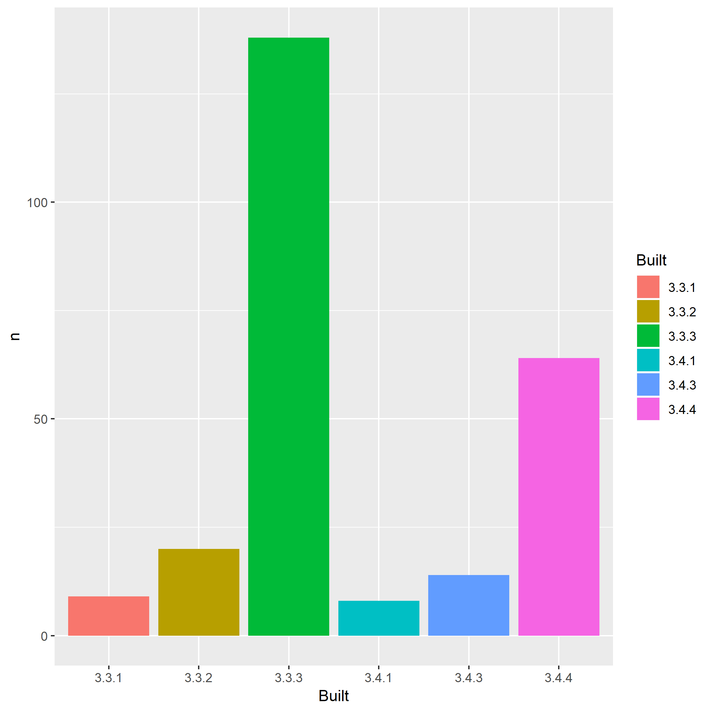

<!-- README.md is generated from README.Rmd. Please edit that file -->

```{r setup, include = FALSE}
knitr::opts_chunk$set(
  collapse = TRUE,
  comment = "#>"
)
library(tidyverse)
```

# packages-report

## Bonus activity prompt

* Combine your work analyzing your R packages and what we've learned re: GitHub and R Markdown
* This `README.Rmd` gives a scaffold for using the work you did earlier to make a little report.
* Given our previous work, I'm using pre-computed results and including a pre-made figure, leaving the R code down in scripts below `R/`. But know that, in other contexts, you could inline all that code in chunks here. Depends on downstream usage and the project context.
* Locally, do `README.Rmd` --> `README.md` with the "Knit" button or via `rmarkdown::render("README.Rmd")`. Commit both.
* I presume you are hooked up to GitHub remote repo, covered in [Existing project, GitHub last](https://happygitwithr.com/existing-github-last.html). Summary:
  - Consider the convenience function `usethis::use_github()`. Or to do by hand:
  - Create a similarly-named repo on GitHub.
  - Add it to the local repo as the `origin` remote: `git remote add origin https://github.com/YOU/REPO.git`.
  - Push and cement the branch tracking relationship: `git push --set-upstream origin master`.
* Push! Now your README is an excellent welcome mat and summary of your project.
* On GitHub, in *Settings*, turn on GitHub Pages. Visit the given URL for an even more polished report of your project. It may take a few minutes to show up / update. Record that as the URL for your repo.

## Overview

The goal of packages-report is to FINISH THIS SENTENCE.

```{r, include = FALSE}
## load data/add-on-packages-freqtable.csv here in this chunk
```

I have `FILL THIS IN!!!` add-on packages installed.

Here's how they break down in terms of which version of R they were built under, which is related to how recently they were updated on CRAN.

```{r, echo = FALSE}
## print the frequency table here
## make it prettier if you know how
```



### Flow of the analysis

*If you have time, document the analysis works, using internal links.*

*If you created some sort of controller script, describe that here.*

<details>

<summary>Session info</summary>
```{r}
devtools::session_info()
```

</details>

*See <https://github.com/jennybc/wtf-packages-report-EXAMPLE> for a fully realized example.*