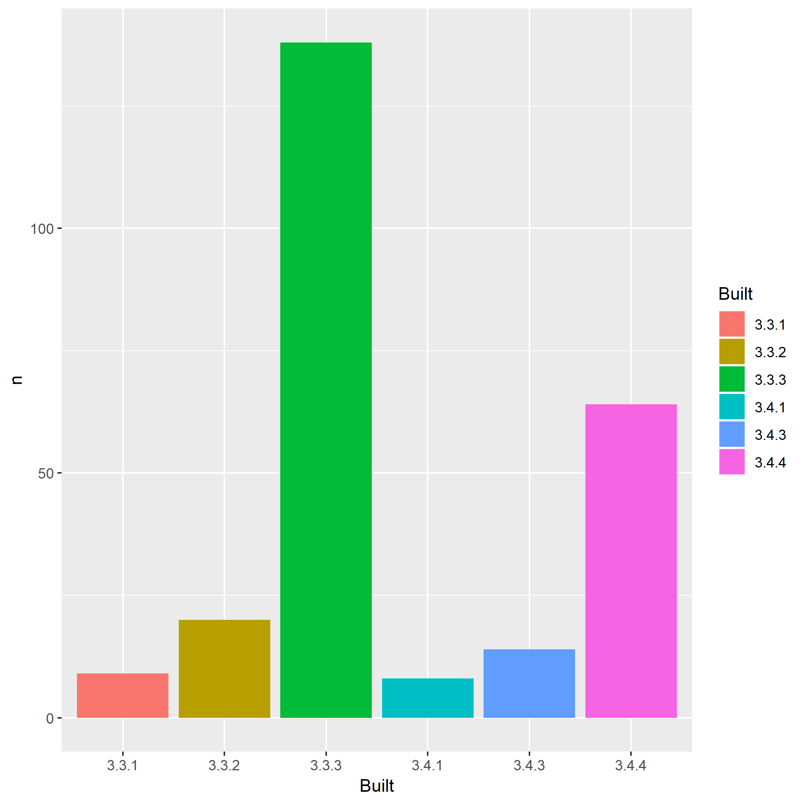

<!-- README.md is generated from README.Rmd. Please edit that file -->
packages-report
===============

Bonus activity prompt
---------------------

-   Combine your work analyzing your R packages and what we've learned re: GitHub and R Markdown
-   This `README.Rmd` gives a scaffold for using the work you did earlier to make a little report.
-   Given our previous work, I'm using pre-computed results and including a pre-made figure, leaving the R code down in scripts below `R/`. But know that, in other contexts, you could inline all that code in chunks here. Depends on downstream usage and the project context.
-   Locally, do `README.Rmd` --&gt; `README.md` with the "Knit" button or via `rmarkdown::render("README.Rmd")`. Commit both.
-   I presume you are hooked up to GitHub remote repo, covered in [Existing project, GitHub last](https://happygitwithr.com/existing-github-last.html). Summary:
-   Consider the convenience function `usethis::use_github()`. Or to do by hand:
-   Create a similarly-named repo on GitHub.
-   Add it to the local repo as the `origin` remote: `git remote add origin https://github.com/YOU/REPO.git`.
-   Push and cement the branch tracking relationship: `git push --set-upstream origin master`.
-   Push! Now your README is an excellent welcome mat and summary of your project.
-   On GitHub, in *Settings*, turn on GitHub Pages. Visit the given URL for an even more polished report of your project. It may take a few minutes to show up / update. Record that as the URL for your repo.

Overview
--------

The goal of packages-report is to FINISH THIS SENTENCE.

I have `FILL THIS IN!!!` add-on packages installed.

Here's how they break down in terms of which version of R they were built under, which is related to how recently they were updated on CRAN.



### Flow of the analysis

*If you have time, document the analysis works, using internal links.*

*If you created some sort of controller script, describe that here.*

<details>

<summary>Session info</summary>

``` r
devtools::session_info()
#> Session info -------------------------------------------------------------
#>  setting  value                       
#>  version  R version 3.4.3 (2017-11-30)
#>  system   x86_64, mingw32             
#>  ui       RTerm                       
#>  language (EN)                        
#>  collate  English_United States.1252  
#>  tz       America/Chicago             
#>  date     2019-01-15
#> Packages -----------------------------------------------------------------
#>  package    * version date       source                            
#>  assertthat   0.2.0   2017-04-11 CRAN (R 3.3.3)                    
#>  backports    1.1.2   2017-12-13 CRAN (R 3.3.3)                    
#>  base       * 3.4.3   2017-12-06 local                             
#>  bindr        0.1.1   2018-03-13 CRAN (R 3.4.4)                    
#>  bindrcpp     0.2.2   2018-03-29 CRAN (R 3.4.4)                    
#>  broom        0.4.2   2017-02-13 CRAN (R 3.3.3)                    
#>  cellranger   1.1.0   2016-07-27 CRAN (R 3.3.3)                    
#>  colorspace   1.3-2   2016-12-14 CRAN (R 3.3.3)                    
#>  compiler     3.4.3   2017-12-06 local                             
#>  datasets   * 3.4.3   2017-12-06 local                             
#>  devtools     1.13.0  2017-05-08 CRAN (R 3.3.3)                    
#>  digest       0.6.15  2018-01-28 CRAN (R 3.3.3)                    
#>  dplyr      * 0.7.6   2018-06-29 CRAN (R 3.4.4)                    
#>  evaluate     0.10.1  2017-06-24 CRAN (R 3.3.3)                    
#>  forcats      0.2.0   2017-01-23 CRAN (R 3.3.3)                    
#>  foreign      0.8-68  2017-04-24 CRAN (R 3.3.3)                    
#>  ggplot2    * 3.0.0   2018-07-05 Github (tidyverse/ggplot2@4f272fe)
#>  glue         1.2.0   2017-10-29 CRAN (R 3.3.3)                    
#>  graphics   * 3.4.3   2017-12-06 local                             
#>  grDevices  * 3.4.3   2017-12-06 local                             
#>  grid         3.4.3   2017-12-06 local                             
#>  gtable       0.2.0   2016-02-26 CRAN (R 3.3.3)                    
#>  haven        1.0.0   2016-09-23 CRAN (R 3.3.3)                    
#>  hms          0.3     2016-11-22 CRAN (R 3.3.3)                    
#>  htmltools    0.3.6   2017-04-28 CRAN (R 3.3.3)                    
#>  httr         1.3.1   2017-08-20 CRAN (R 3.3.3)                    
#>  jsonlite     1.5     2017-06-01 CRAN (R 3.3.3)                    
#>  knitr        1.18    2017-12-27 CRAN (R 3.3.3)                    
#>  lattice      0.20-35 2017-03-25 CRAN (R 3.3.3)                    
#>  lazyeval     0.2.1   2017-10-29 CRAN (R 3.3.3)                    
#>  lubridate    1.7.1   2017-11-03 CRAN (R 3.3.3)                    
#>  magrittr     1.5     2014-11-22 CRAN (R 3.3.3)                    
#>  memoise      1.1.0   2017-04-21 CRAN (R 3.3.3)                    
#>  methods    * 3.4.3   2017-12-06 local                             
#>  mnormt       1.5-5   2016-10-15 CRAN (R 3.3.2)                    
#>  modelr       0.1.0   2016-08-31 CRAN (R 3.3.3)                    
#>  munsell      0.4.3   2016-02-13 CRAN (R 3.3.3)                    
#>  nlme         3.1-131 2017-02-06 CRAN (R 3.3.3)                    
#>  parallel     3.4.3   2017-12-06 local                             
#>  pillar       1.1.0   2018-01-14 CRAN (R 3.3.3)                    
#>  pkgconfig    2.0.1   2017-03-21 CRAN (R 3.3.3)                    
#>  plyr         1.8.4   2016-06-08 CRAN (R 3.3.3)                    
#>  psych        1.7.5   2017-05-03 CRAN (R 3.3.3)                    
#>  purrr      * 0.2.5   2018-05-29 CRAN (R 3.4.4)                    
#>  R6           2.2.2   2017-06-17 CRAN (R 3.3.3)                    
#>  Rcpp         0.12.17 2018-05-18 CRAN (R 3.4.4)                    
#>  readr      * 1.1.0   2017-03-22 CRAN (R 3.3.3)                    
#>  readxl       1.0.0   2017-04-18 CRAN (R 3.3.3)                    
#>  reshape2     1.4.3   2017-12-11 CRAN (R 3.3.3)                    
#>  rlang        0.2.1   2018-05-30 CRAN (R 3.4.4)                    
#>  rmarkdown    1.8     2017-11-17 CRAN (R 3.3.3)                    
#>  rprojroot    1.3-2   2018-01-03 CRAN (R 3.3.3)                    
#>  rvest        0.3.2   2016-06-17 CRAN (R 3.3.3)                    
#>  scales       0.5.0   2017-08-24 CRAN (R 3.3.3)                    
#>  stats      * 3.4.3   2017-12-06 local                             
#>  stringi      1.1.6   2017-11-17 CRAN (R 3.3.3)                    
#>  stringr      1.2.0   2017-02-18 CRAN (R 3.3.3)                    
#>  tibble     * 1.4.2   2018-01-22 CRAN (R 3.3.3)                    
#>  tidyr      * 0.8.1   2018-05-18 CRAN (R 3.4.4)                    
#>  tidyselect   0.2.4   2018-02-26 CRAN (R 3.4.4)                    
#>  tidyverse  * 1.1.1   2017-01-27 CRAN (R 3.3.3)                    
#>  tools        3.4.3   2017-12-06 local                             
#>  utils      * 3.4.3   2017-12-06 local                             
#>  withr        2.1.2   2018-07-05 Github (jimhester/withr@fe56f20)  
#>  xml2         1.1.1   2017-01-24 CRAN (R 3.3.3)                    
#>  yaml         2.1.16  2017-12-12 CRAN (R 3.3.3)
```

</details>

*See <https://github.com/jennybc/wtf-packages-report-EXAMPLE> for a fully realized example.*
